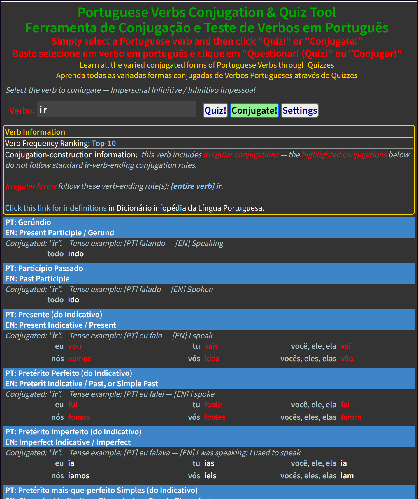

# VerbosPT : Portuguese Verb Conjugator and Quiz Application

This is a browser-based HTML, CSS, JS application which efficiently produces __European Portuguese__ Verb Conjugations and simultaneously includes a quiz feature that allows you to test your conjugation knowledge. The quiz mode includes visual feedback cues to let you know if each letter, as you type, is correct, correct but not properly accented / etc., or is completely wrong; furthermore, there are "hint cards" that, upon mouseover, temporarily flip to reveal any letter(s) you may be struggling to get right during your quiz.

Although this project currently targets __European Portuguese__ conjugations (for Portugal), it can be easily adapted to Brazilian Portuguese by simply updated the ConjugationRules spreadsheet data to produce the forms as they are commonly used in Brazil.  __English__ has been chosen as the common UI language for this application so that it is accessible to as many new PT-language learners as possible.
  

## Screenshots
Via the Settings, you can alter which combination of verb tense(s) and subject(s) are displayed in both the Conjugator mode and the Quiz mode.  There is a filter that allows you to choose only regular verbs, verbs with multiple participles, and more. You can also choose what verb popularity groups to include (e.g., Top-10, Top-25, etc.), and what additional helpful information to include in the output.
  

### Verb Conjugator Mode

  

### Verb Conjugations Quiz Tool Mode

  

## What differentiates this Portuguese Verb Conjugation and Verb Quizzing Tool?
Minimal Size (~26Kb gzipped hosting footprint total) and minimal network traffic (there is no backend database or other data source to communicate with)! The web application implements all of its functionality — including all code and all verb data used by the app — within client-side HTML / CSS / JS files that fit into an amazingly small total footprint. This is with over 1000 verbs available and conjugations in 22 forms (single and compound forms) and 6 subjects (grammatical persons). Adding additional verbs will have very little effect on the total application size.

This minimal size is achieved by the fact that the application is not simply storing a giant list of precalculated conjugations, but rather __it is calculating conjugations on-the-fly for a chosen verb by employing a very refined hierarchical set of language rules for how to form such verb conjugations__.  The rules are maintained in Google Sheets along with the available-verbs list, and this web-application uses generated JS code (generated via a custom Apps Script in G-sheets) as the basis for forming the final conjugations when a user chooses a verb to either conjugate or to be quizzed on.
  

## Technology Used
This project uses a combination of the following languages and technologies:  
* __Google Sheets__: for basic data management (of a Verbs list and hierarchical Conjugation Rules), plus specialized functionality via the custom Apps Script Extension "CreateJS", described below. The workbook contains three sheets:  
    1)  __VerbConjugationRules__ (VCR) sheet — the critically important hierarchical conjugation rules data; see Notes sheet for further details.
    2)  __KnownVerbs__ (KV) sheet — This is basically a list of the verbs that will be available to the Conjugator / Quiz web-based app UI.  In addition to the list of verbs, in their infinitive form, the additional columns provide information necessary to produce the conjugations programmatically
    3)  __Notes__ sheet — see for more detailed notes and descriptions of the contents of the prior two sheets.
  

* __Google Apps Script__: a custom Extension for this workbook — that will be referred to as "__CreateJS__" hereafter — includes functionality to:  
    1) process the KnownVerbs data and pre-compute / assign which conjugation rule is the most specific rule that applies to each verb;  
    2) create generated JS code — which is to be pasted into formed-verbs.js — which contains conjugation rules information used by the web application;  
    3) create generated JS code — which is to be pasted into known-verbs.js — which contains the list of available verbs plus conjugation-formation rules and related directives.
  
* __JavaScript__ — including MutationObserver, paste handling via ExecCommand, and localStorage for saving user preferences locally.  
    * There is no reliance on any other libraries; all functionality is contained within this project;  
    * I created an ES6+ Class-based implementation of an autocomplete dropdown list select control for use in this project (see autocomplete.js / .css files) for the verb-chooser;  
    * Note that ExecCommand has been flagged as obsolete on MDN, even though it is still widely supported in Chrome and other major browsers and likely will remain so for ages since there is no easy standard direct replacement alternative.  See this: https://stackoverflow.com/questions/60581285/execcommand-is-now-obsolete-whats-the-alternative
  
* __HTML__ — there is some programmatic DOM manipulation as the core content of each page is generated in code with further DOM manipulation for animation and visual cues.
  
* __CSS__ — includes media queries for responsive UI.
  

This application has been __tested with Google Chrome browser and Firefox__.  
__Firefox Note__: the MutationObserver oddly does not trigger on the first character typed into a field, but only upon the second or subsequent characters. This seems to be a bug (or odd "feature") with FF.
  

## Creating the G-Sheets Workbook and Apps Script Project
Within this repository, the directory "g-sheets-app" contains the G-sheets workbook exported as "VerbosPT-workbook.ods" (OpenDocument Spreadsheet format). Upload this file into your Google Drive and open it with Google Sheets and then save it in native G-sheets format. Next, from within the open G-Sheets "VerbosPT-workbook", navigate to the menu item "Extension" and select "Apps Script".  Once you are in the Apps Script editor environment:  
    1) change the default "Untitled project" to "CreateJS" (or another name of your choosing);  
    2) replace the contents of the auto-generated "Code.js" file with the contents of that same filename from this GitHub repository;  
    3) click the "+" button to add a new HTML file and name it Dialog.html, replacing its contents with the contents of that same filename from this GitHub repository;  
    4) save the project.  
  
You should (perhaps a browser refresh will be necessary) now see in your G-sheet, under the "Extensions" menu (and probably last entry in this menu), a new menu option called "CreateJS" (or whatever name you alternatively chose).  Open the menu item presented and you will see the dialog with the 3 options, as shown below. __Note__: you will be warned about how the script will have full access to your G-drive and such and you will have to allow it to have access in order to run; please review the "Code.js" file and make sure you feel comfortable with how it performs the JS output-file writing operations: it does NOT create any new files (in fact, for security purposes, you have to manually create the two initial files it will write to), and it does not delete any files either. The Code.js implements the "@OnlyCurrentDoc" directive at the top, which is supposed to limit the script to only accessing the current spreadsheet, but yet a warning still shows about how the script needs access to everything imaginable. 

  

## Adding new Verbs and Updating Conjugation Rules
Refer to the notes within the G-sheets workbook for more details.  In addition, refer to the known-verbs.js and formed-verbs.js files to see where the G-sheets apps script generated JS file content should be merged into the web application.  

Because there is a chance that, when you make additions or alterations to the conjugation-rules or verbs-list, you could cause unintentional alterations to existing and already correct verb conjugations, there is an __Administrative / Troubleshooting feature__ built into the web application code that will create a comprehensive textual dump of __all verbs conjugated in all tenses and subjects__.  See the last portion of "main.js" code for how to enable it. By comparing the texual output before/after any changes (using a visual differencing tool), you can quickly see the impact of your changes.
  

## Creating the Conjugator / Quiz tool web application
Basically just copy the .html, .js, and .css files from the root of this repository into a directory on your local system or web server. The "verbos-pt.html" is the user-facing single-page application.
  

## Further Help / Notes
See the inline comments and notes throughout the various project files.  A reasonable level of Portuguese language, and specifically PT Verb conjugation knowledge, will be quite helpful in understanding how everything functions.  If you are new to the PT language, understanding the deconstructed conjugation rules hierarchy that appears in the G-Sheets VerbConjugationRules sheet will perhaps help you more quickly visualize the how and why conjugations are formed as they are, and committing these very reduced rules to memory can allow you to conjugate nearly any verb effectively even if you have never encountered it before.
  

## Outstanding Tasks
I expect to eventually include a Portuguese (PT) language translation of this README file content as well as including PT translations of any UI elements that are still English-only.  

I have noticed that on occasion, the local storage of Settings data seems to get out-of-sync with the UI. Until the root-cause is identified and this is truly resolved, a total "reset" of the application Settings/Preferences can be done, e.g., via Chrome's Developer Tools, Application, Local Storage: clear.  Then, refresh the page and set to your liking.
